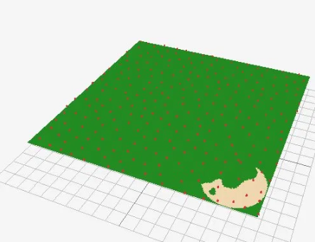
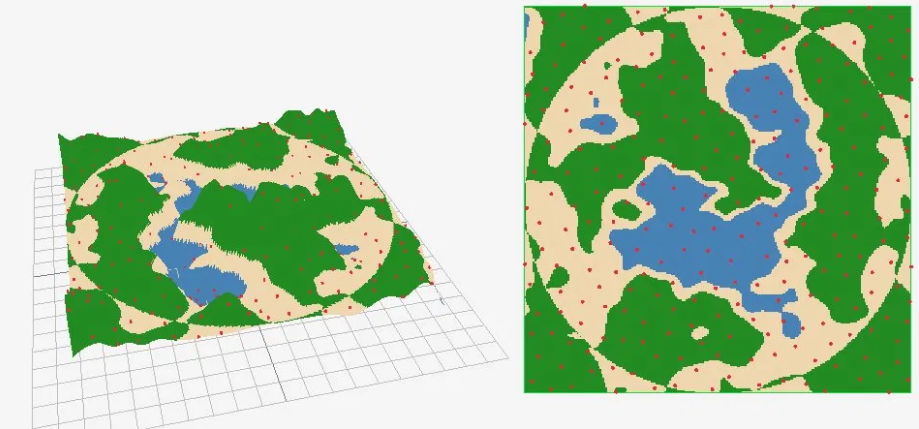

# Rapport de projet

## sous quelle plateforme vous avez développé le projet (Linux, Windows, macOS)

Uniquement sous windows

## les choix algorithmiques faits

- Bruit fractal : j'ai utilisé le code fourni dans l'article, j'ai testé les 2 fonctions 

**Version 1:**
```cpp
float fbm(in vecN x, in float H)
{    
    float t = 0.0;
    for (int i = 0; i < numOctaves; i++)
    {
        float f = pow(2.0, float(i));
        float a = pow(f, -H);
        t += a * noise(f * x);
    }
    return t;
}
```

**Version 2:**
```cpp
float fbm(in vecN x, in float H)
{    
    float G = exp2(-H);
    float f = 1.0;
    float a = 1.0;
    float t = 0.0;
    for (int i = 0; i < numOctaves; i++)
    {
        t += a * noise(f * x);
        f *= 2.0;
        a *= G;
    }
    return t;
}
```

J'ai retenu la deuxième car elle est plus répandue car les appels à `pow()` de la version 1 sont trop coûteux en performance

- Masque radial: pour génerer le masque j'ai fait une fonction qui calcule la distance entre un point et le centre et qui génère une valeur entre -1 et 1 en fonction si on est proche ou éloigné du centre en utilisant un `glm::distance` pour le calcul

- Maillage: j'ai fait un struct et un tableau pour les couleurs de l'ile et leurs altitudes puis j'ai utulisé des `std::lerp` pour faire des degradés progressifs entre les couleurs


## les paramètres retenus et leur impact visuel


## les difficultés rencontrées et solutions

- J'ai eu du mal à implémenter le masque parce que je ne trouvais pas le centre de l'île. Au début, dans la fonction `octaveNoise`, je passais `position` directement à `radialMask` mais le masque était trop petit et se retrouvait dans un coin. J'ai ensuite essayé de hardcoder le centre avec des coordonnées approximatives `glm::vec2 center = {4.0f, 4.0f}`, puis j'ai cherché un moyen de passer la taille de l'île en paramètre. J'avais aussi pensé à mettre une image png et extraire le masque de cette image mais je me suis dis qe ce n'est probablement pas ce qui est attendu.
La solution était finalement beaucoup plus simple : passer un paramètre supplémentaire à `octaveNoise` qui est `p` avant la multiplication par `noiseScale`, d'où le deuxième argument ici : `octaveNoise(p * context.imageGenerationParameters.noiseScale, p, noiseFunction)`

- la gestion des bords pour le poisson disk sampling -> des points sortent de la map

## quelques captures d'écran comparatives

le masque qui se met dans un coin de l'ile : <br>


difficulté à mettre le masque correctement <br>



## "Post mortem" pour analyser le travail fourni : qu'est-ce qui a bien fonctionné, quels ont été les problèmes rencontrés, comment vous les avez surmontés, et ce que vous auriez fait différemment. Avec plus de temps, qu'est-ce que vous pourriez ajouter ? Comment s'est passée la répartition du travail dans le groupe ?

- La fonction qui génère les octaves a été facile à implémenter et fonctionne bien

- Le masque reste un peu bancal, il vient se poser sur les octaves mais quand il y a des bosses trop hautes sur les côtés, ca forme des mini-plages que je ne peux pas empécher. Je trouve que ça rend bien quand même

- Poisson Disk Sampling : avoir voulu implémenter l'algorithme en se basant seulement sur le papier de recherche et l'article au lieu de directement regarder une vidéo qui m'aurait fait gagner beaucoup de temps à essayer de comprendre sans réelle visualisation 