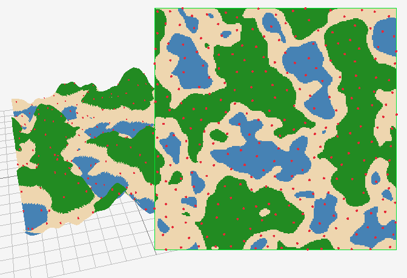
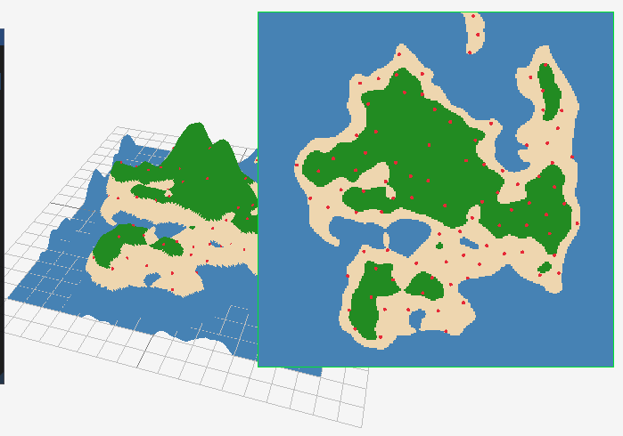
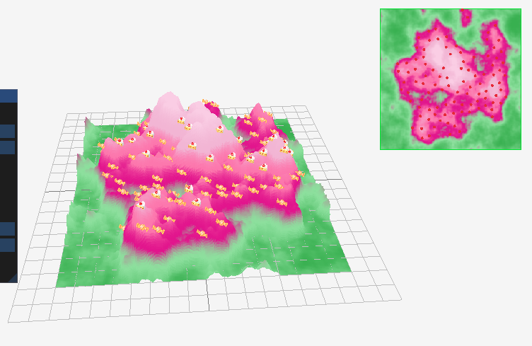
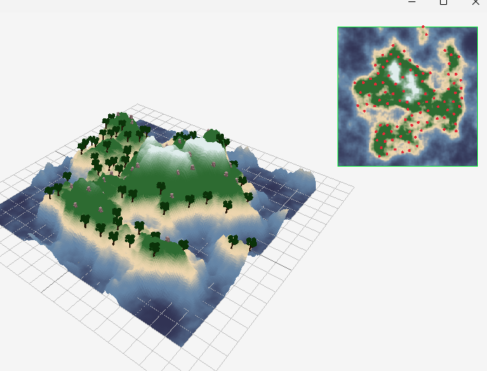
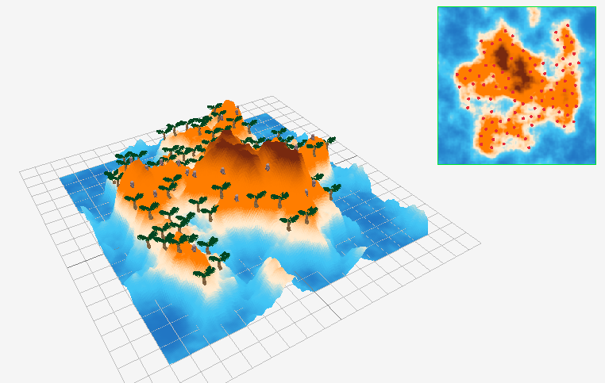
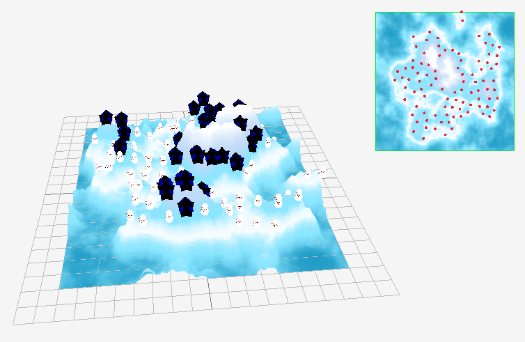

# Rapport de projet : Alina ZHYLA et Marine SLIMANE

## Sous quelle plateforme vous avez développé le projet (Linux, Windows, macOS) ?

Uniquement sous windows.

## Choix algorithmiques faits

- Bruit fractal : Nous avons utilisé le code fourni dans l'article et nous avons testé les 2 fonctions 

**Version 1:**
```cpp
float fbm(in vecN x, in float H)
{    
    float t = 0.0;
    for (int i = 0; i < numOctaves; i++)
    {
        float f = pow(2.0, float(i));
        float a = pow(f, -H);
        t += a * noise(f * x);
    }
    return t;
}
```

**Version 2:**
```cpp
float fbm(in vecN x, in float H)
{    
    float G = exp2(-H);
    float f = 1.0;
    float a = 1.0;
    float t = 0.0;
    for (int i = 0; i < numOctaves; i++)
    {
        t += a * noise(f * x);
        f *= 2.0;
        a *= G;
    }
    return t;
}
```

Nous avons retenu la deuxième car elle est plus répandue car les appels à `pow()` de la version 1 sont trop coûteux en performance

- Masque radial: pour génerer le masque nous avons fait une fonction qui calcule la distance entre un point et le centre et qui génère une valeur entre -1 et 1 en fonction si on est proche ou éloigné du centre en utilisant un `glm::distance` pour le calcul

- Maillage: nous avons fait un struct et un tableau pour les couleurs de l'ile et leurs altitudes puis nous avons utilisé des `std::lerp` pour faire des degradés progressifs entre les couleurs
- Poisson Disk Sampling : Nous nous sommes basé sur la vidéos fournit. `grid` et `active_list` contiennent des indices associés aux positions
- Améliorations : Pour gérer le choix des modèles 3D en fonction du biome et de la height, nous avons ajouté dans `Appcontext` `std::unordered_map<BiomeModel, Model> objectModels` avec 
```cpp
enum class BiomeModel // all model types used in biomes
{
    PalmTree,
    ForestTree,
    Rock,
    Snowman,
    House,
    Candy,
    Cake
}
```
Ainsi on peut connaître la nature du modèle 3D. Nous avons donc aussi ajouter une fonction de hachage pour le type `BiomeModel` :
```cpp
namespace std
{
    template<>
    struct hash<BiomeModel> 
    {
        std::size_t operator()(const BiomeModel& b) const 
        {
            return std::hash<int>{}(static_cast<int>(b)); // converting BiomeModel variable in int and using standard hashing for ints
        }
    };
}
```
Nous avons aussi modifié `objectPositions` qui est maintenant un `std::vector<Object>` avec 
```cpp
struct Object // informations about 3D models objects
{
    glm::vec3 position; // its position
    BiomeModel modelType; // its type
};
```
ce qui permet d'avoir la position et la nature du modèle stocké au même endroit. 
De même pour avoir un scale différent pour chaque objet 3D, nous avons ajouté `std::unordered_map<BiomeModel, float> objectScales` dans `Appcontext`.
Nous avons fait le choix d'utiliser des `unordered_map` plutôt que des tableaux car ainsi le nom des clés est explicite et la complexité est basse grâce au hashage.

## Paramètres retenus et leur impact visuel
- Sur l'interface, on peut changer la forme du terrain grace à la seed, le niveau de bruit (noise scale) et la résolution. On peut également changer de biome (Forest, Desert, Snowy Moutain et Candy Kingdom). Pour chaque biome, les modèles 3D changent ainsi que les scales de chaque modèle 3D. On peut également modifier toutes les couleurs dans chaque biome avec le Color Picker. Nous avons gardé la regénération de positions et la slider pour changer le scale présents originalement.

## Difficultés rencontrées et solutions

- Nous avons eu du mal à implémenter le masque parce que nous ne trouvions pas le centre de l'île. Au début, dans la fonction `octaveNoise`, nous passions `position` directement à `radialMask` mais le masque était trop petit et se retrouvait dans un coin. Nous avons ensuite essayé de hardcoder le centre avec des coordonnées approximatives `glm::vec2 center = {4.0f, 4.0f}`, puis nous avons cherché un moyen de passer la taille de l'île en paramètre. Nous avons aussi pensé à mettre une image png et extraire le masque de cette image mais nous nous sommes dit que ce n'était probablement pas ce qui était attendu.
La solution était finalement beaucoup plus simple : passer un paramètre supplémentaire à `octaveNoise` qui est `p` avant la multiplication par `noiseScale`, d'où le deuxième argument ici : `octaveNoise(p * context.imageGenerationParameters.noiseScale, p, noiseFunction)`

- Nous avons eu du mal avec la gestion des bords pour le poisson disk sampling (des points sortent de la map).
- Nous avons eu du mal avec la gestion des modèles 3D par biome et par hauteur. Les choix algorithmiques que l'ont a fait pour parvenir à résoudre ce problème ont demandé beaucoup de modifications du code et parfois même du code de base ce qui était assez long à faire. Mais au final, ces choix d'implémentations nous ont fait réviser les `unordered_map` et étaient satisfaisants à faire. 

## Quelques captures d'écran comparatives :

Nous avons pris pas mal de screenshots au début puis nous avons oublié de le faire...

Le masque qui se met dans un coin de l'ile : <br>


Difficulté à mettre le masque correctement : <br>


Résultat après Poisson Disk Sampling :<br>


Résultat après filtre des positions et nouvelle heightmap :<br>


Résultat final des biomes :<br>

<br>




## "Post mortem" : analyse du travail fourni 

## Qu'est-ce qui a bien fonctionné ?
- L'organisation du travai
- La fonction qui génère les octaves a été facile à implémenter et fonctionne bien
- Le choix des visuels était satisfaisant

## Quels ont été les problèmes rencontrés ? Comment les avez-vous surmontés, et qu'auriez-vous fait différemment ?

- Le masque reste un peu bancal, il vient se poser sur les octaves mais quand il y a des bosses trop hautes sur les côtés, ca forme des mini-plages que nous ne pouvons pas empécher.Nous trouvons que ça rend bien quand même
- Poisson Disk Sampling : Nous regrettons avoir voulu implémenter l'algorithme en se basant seulement sur le papier de recherche et l'article au lieu de directement regarder une vidéo. Cela nous aurait fait gagner beaucoup de temps car nous avons essayé de comprendre sans réelle visualisation 
- Nous aurions pu réfléchir d'avantage aux choix d'implémentations avant de se lancer pleinement dans le projet car certaines des améliorations ont demandé une refonte du code qui était assez longue et complexe. Y avoir réfléchi plus tôt aurait été un gain de temps.

## Avec plus de temps, qu'est-ce que vous pourriez ajouter ? 

- Ajouter d'autres masques pour les formes de l'île, combiner les types de bruit...

## Comment s'est passée la répartition du travail dans le groupe ?

- Alina : Bruit factal, Génération de heightmap et couleurs + améliorations des palettes de couleurs et biomes
  
- Marine : Distribution de points par Poisson disk sampling, Placement des objets sur le terrain + amélioration des modèles 3D par biome et par condition (height)
